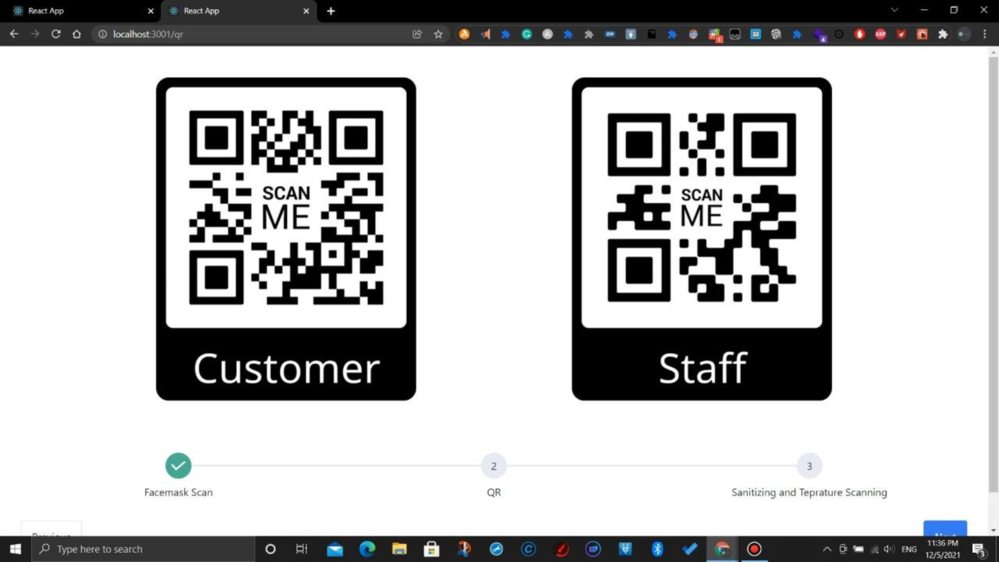

# Covid Pro - Covid Protocol Assistance App For Shops

Covid Pro is an integrated system developed with the intention of being used by shops to ensure that thjeir customers and staff follow some of the most essential protocols againts Covid-19 spread.

This app concist of 3 main components.
- Web App for Shops
- Mobile App for Customers
- Hardware Part

## Web App for Shops

In this shop can authenticate and access the system. After that the scanning process can be started.

On that When customer eneters to the shop,
- Facemask is detected
- Temprature is measured
- Then Automatic Hand Sanitization is done 

After that customer can enter the shop safely.

## Mobile App

Authentication and Recognize and store data to shop by QR code scanning.

## Hardware Part

Automatic Hand Sanitizer which triggers when user hand is near.
Temperature Measurement of user.

# Tech Stack

- MERN
- Tailwind CSS
- Tensorflow
- InVision Studio
- React Native
- Arduino
- Vercel

# Hardware Part

- Arduino board
- MLX90614ESF MLX90614 contactless temperature sensor module
- HC-SR04 ultrasonic distance sensor
- USB cable for connection
- Display unit
- Webcam